# Policy Hub - Comprehensive Architecture Document

**Version:** 1.0  
**Date:** June 2026  
**Project:** PolicyHub - Enterprise Policy Management System  

---

## Executive Summary

Policy Hub is a modern, cloud-native enterprise policy management platform designed to streamline policy distribution, enforcement, and acknowledgment across organizations. Built with a scalable microservices approach on Azure infrastructure, the system ensures secure authentication, role-based access control (RBAC), and comprehensive audit trails.

### Key Features
- Azure AD SSO authentication with MSAL
- Role-based access control (Employee, HRAdmin, Auditor, SuperAdmin)
- Policy versioning and approval workflows
- Digital signatures and policy acknowledgments
- Real-time notifications
- Comprehensive audit logging
- Secure blob storage for policy documents

### Technology Stack
- **Frontend:** React 18.3, TypeScript, Axios, Azure MSAL
- **Backend:** .NET 8, ASP.NET Core, Entity Framework Core
- **Database:** Azure SQL Server
- **Storage:** Azure Blob Storage
- **Authentication:** Azure Entra ID (Azure AD)
- **Deployment:** Azure App Service, Azure SQL Database

---

## 1. HIGH-LEVEL DESIGN (HLD)

### 1.1 System Overview

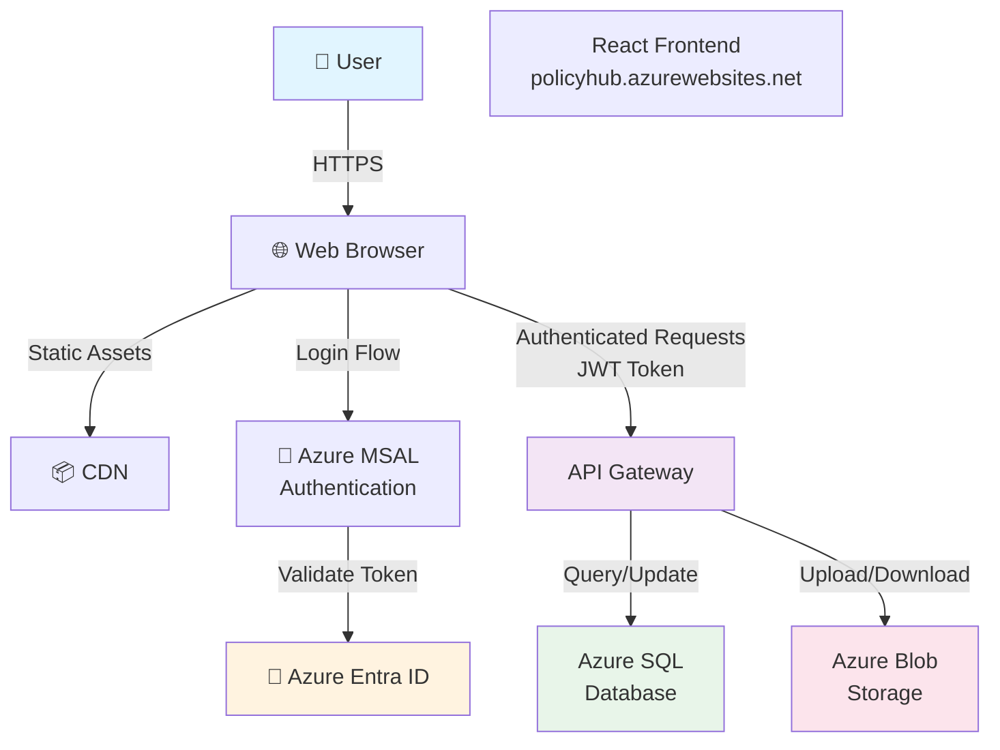

### 1.2 Layered Architecture

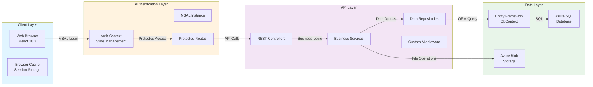

### 1.3 Core Domains

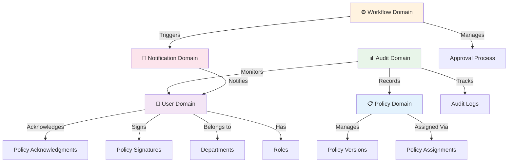

---

## 2. LOW-LEVEL DESIGN (LLD)

### 2.1 Frontend Architecture

```mermaid
graph TB
    subgraph App["React Application"]
        index["index.js<br/>Entry Point"]
        App["App.js<br/>Router Setup"]
        
        subgraph Pages["Page Components"]
            Login["Login.jsx"]
            Dashboard["Dashboard.jsx"]
            Policies["Policies.jsx"]
            Users["Users.jsx"]
            Admin["Admin Pages"]
            History["History.jsx"]
        end
        
        subgraph Context["Context API"]
            AuthContext["AuthContext.jsx<br/>Authentication State"]
        end
        
        subgraph Layouts["Layout Components"]
            MainLayout["MainLayout.jsx"]
            Navigation["Navigation.jsx"]
            Sidebar["Sidebar.jsx"]
        end
        
        subgraph Common["Common Components"]
            FullScreenLoader["FullScreenLoader"]
            ViewSwitcher["ViewSwitcher"]
            Notifications["Notifications"]
        end
        
        subgraph Routes["Route Protection"]
            ProtectedRoute["ProtectedRoute"]
            RoleGuard["Role Guard Logic"]
        end
        
        subgraph Services["Services"]
            AuthService["authService.js"]
            AxiosClient["axiosClient.js"]
            MsalConfig["msalConfig.js"]
        end
    end
    
    index --> App
    App --> Pages
    App --> ProtectedRoute
    ProtectedRoute --> RoleGuard
    AuthContext --> AuthService
    AuthService --> MsalConfig
    Pages --> Layouts
    Pages --> Common
    AxiosClient -->|HTTP Requests| API["REST API"]
    
    style AuthContext fill:#fff3e0
    style ProtectedRoute fill:#ffe0b2
    style Services fill:#f3e5f5
```

### 2.2 Backend Architecture

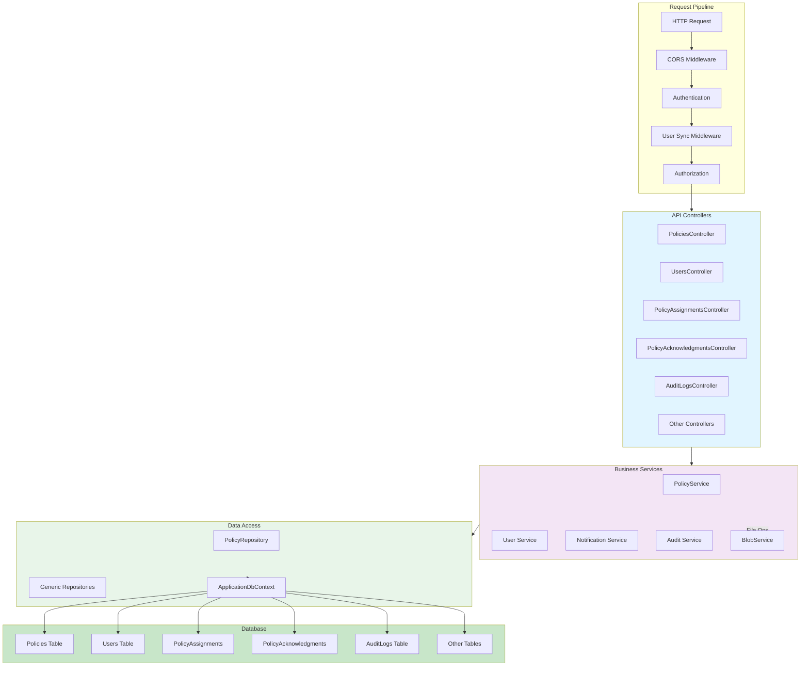

### 2.3 Entity Relationships

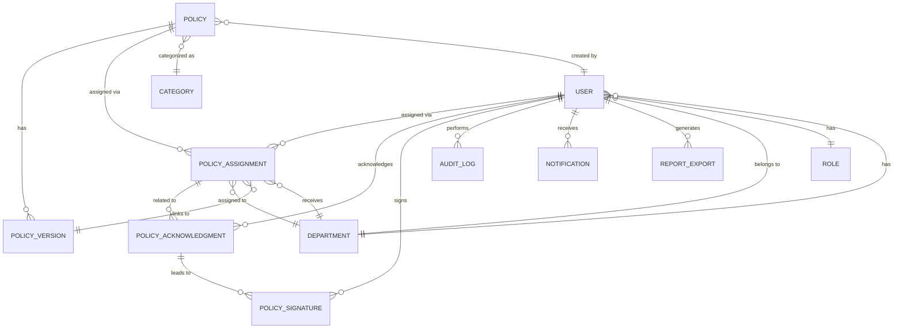

---

## 3. COMPONENT DIAGRAM

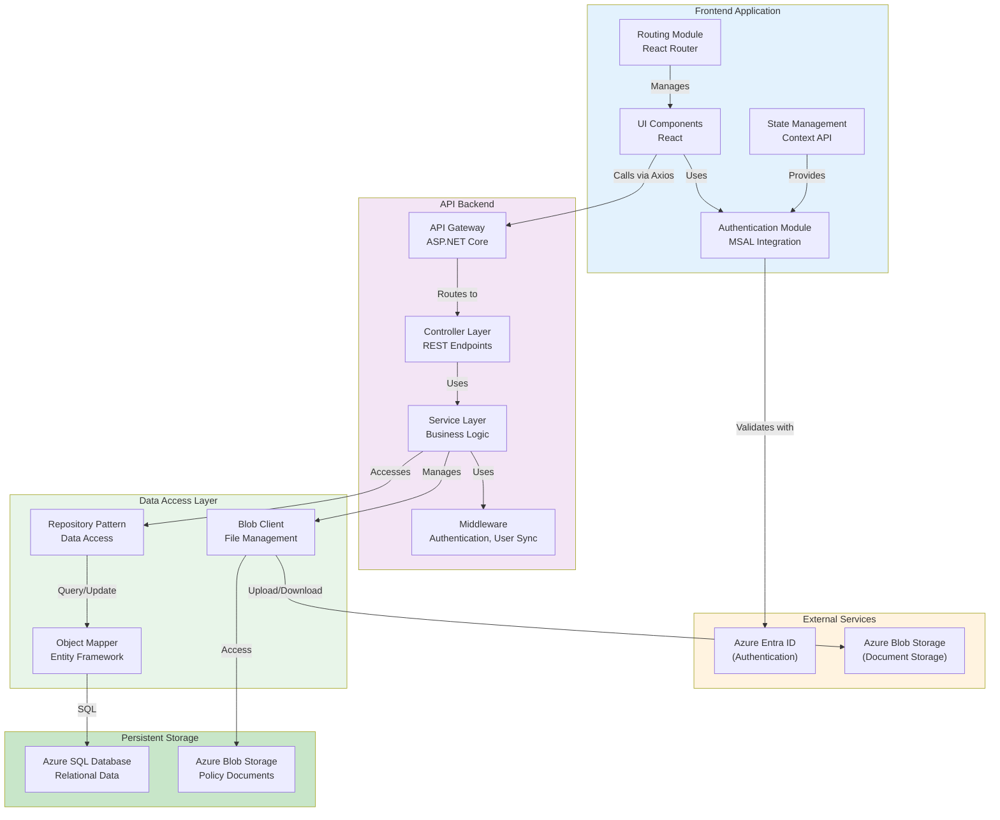

---

## 4. DEPLOYMENT DIAGRAM

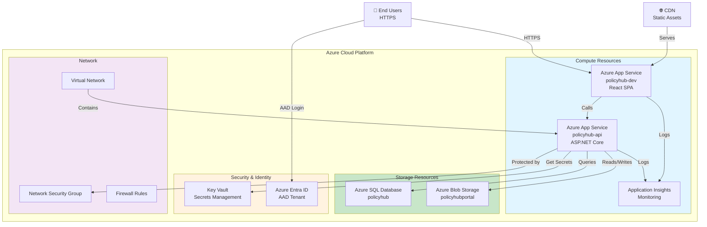

---

## 5. DATABASE ER DIAGRAM

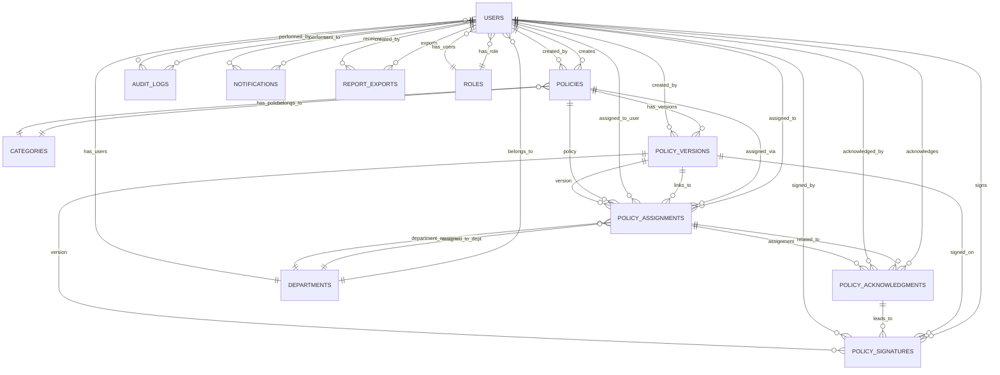

### 5.1 Key Tables

**Users Table**
- UserId (PK)
- FullName, Email
- AzureObjectId, DepartmentId, RoleId
- IsActive, CreatedAt, LastLogin

**Policies Table**
- PolicyId (PK)
- Title, Description
- CategoryId, CreatedBy
- BlobPath (link to Azure Blob)
- IsActive, CreatedAt

**Policy Assignments Table**
- AssignmentId (PK)
- PolicyId, AssignedToUserId/AssignedToDepartmentId
- IsMandatory, AssignedDate

**Policy Acknowledgments Table**
- AcknowledgmentId (PK)
- AssignmentId, UserId
- Status (Pending/Acknowledged)

**Audit Logs Table**
- AuditId (PK)
- UserId, Action, EntityType
- Timestamp

---

## 6. AUTHENTICATION FLOW DIAGRAM

```mermaid
sequenceDiagram
    actor User
    participant Browser
    participant MSALLib["MSAL Library"]
    participant AzureAD["Azure Entra ID"]
    participant AuthContext["AuthContext"]
    participant API["REST API"]
    
    User->>Browser: Click "Sign in with Microsoft"
    activate Browser
    
    Browser->>MSALLib: loginRedirect()
    activate MSALLib
    
    MSALLib->>AzureAD: Redirect to login page
    deactivate MSALLib
    activate AzureAD
    
    AzureAD-->>User: Display login form
    User->>AzureAD: Enter credentials
    
    AzureAD->>AzureAD: Validate credentials
    AzureAD->>AzureAD: Generate JWT Token
    
    AzureAD-->>Browser: Redirect with authorization code
    deactivate AzureAD
    
    activate Browser
    Browser->>MSALLib: handleRedirectPromise()
    activate MSALLib
    
    MSALLib->>MSALLib: Exchange code for token
    MSALLib->>MSALLib: Cache token in localStorage
    MSALLib-->>AuthContext: Token & Account info
    deactivate MSALLib
    
    activate AuthContext
    AuthContext->>AuthContext: Set isAuthenticating=true
    AuthContext->>API: GET /Users/me (with JWT Bearer token)
    deactivate AuthContext
    
    activate API
    API->>API: Validate JWT signature
    API->>API: Extract user claims
    API->>API: Query database for user roles
    API-->>AuthContext: User data + roles
    deactivate API
    
    AuthContext->>AuthContext: Create merged user object
    AuthContext->>AuthContext: Set user state
    AuthContext->>AuthContext: Set loading=false
    deactivate AuthContext
    
    Browser->>Browser: Redirect to /dashboard
    deactivate Browser
```

---

## 7. LOGIN SEQUENCE DIAGRAM

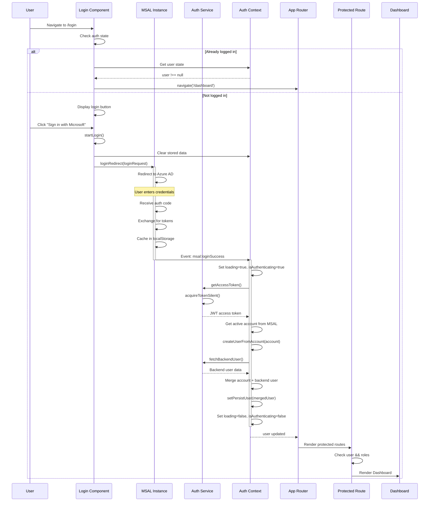

---

## 8. POLICY UPLOAD FLOW

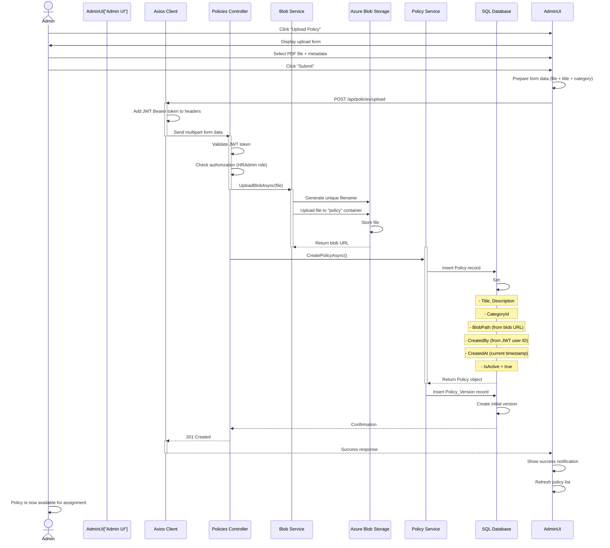

---

## 9. POLICY APPROVAL WORKFLOW

```mermaid
stateDiagram-v2
    [*] --> Draft: Policy Created
    
    Draft --> PendingReview: Submit for Review
    
    PendingReview --> Approved: HR Admin<br/>Approves
    PendingReview --> Rejected: HR Admin<br/>Rejects
    
    Rejected --> Draft: Return to Draft
    
    Approved --> PendingAssignment: Ready for<br/>Assignment
    
    PendingAssignment --> Assigned: HR Admin<br/>Assigns to Dept/User
    
    Assigned --> NotificationSent: Send<br/>Notifications
    
    NotificationSent --> Acknowledged: Employees<br/>Acknowledge
    
    Acknowledged --> Signed: Employees<br/>Sign
    
    Signed --> Complete: All users<br/>signed & acknowledged
    
    Complete --> Archived: Policy<br/>Retention Period<br/>Expires
    
    Archived --> [*]
    
    note right of Draft
        Admin creates policy
        Uploads document
    end
    
    note right of PendingReview
        Awaiting HR/SuperAdmin
        approval
    end
    
    note right of Approved
        Policy content
        validated
    end
    
    note right of Assigned
        Department/User
        assigned policy
    end
    
    note right of Acknowledged
        User reads policy
        Acknowledges receipt
    end
    
    note right of Signed
        User digitally signs
        document
    end
```

---

## 10. DETAILED APPROVAL WORKFLOW WITH ACTORS

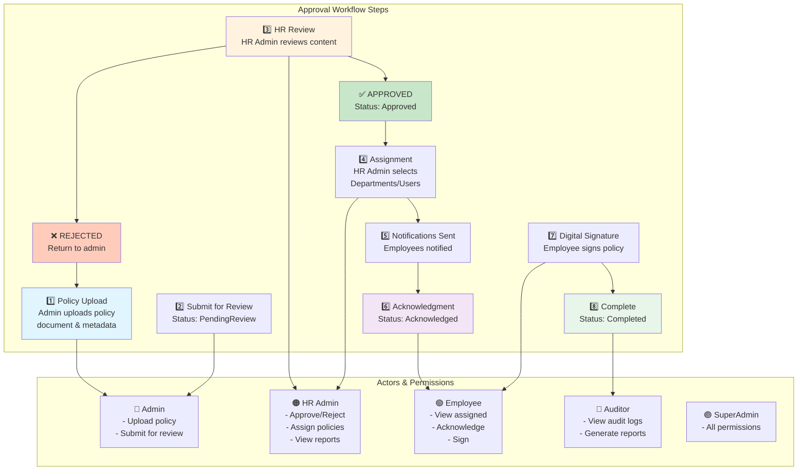

---

## 11. AZURE ARCHITECTURE DIAGRAM

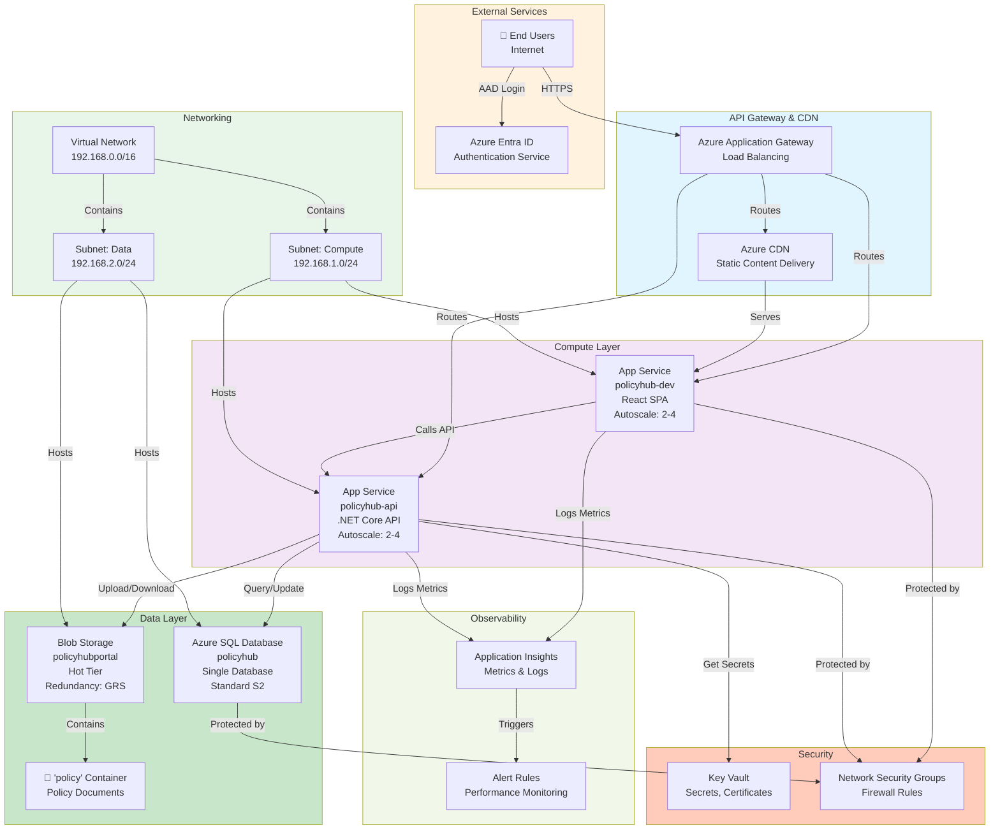

---

## 12. ROLE-BASED ACCESS CONTROL (RBAC)

```mermaid
graph TB
    subgraph Roles["User Roles"]
        Employee["👤 Employee"]
        HRAdmin["🔐 HR Admin"]
        Auditor["📊 Auditor"]
        SuperAdmin["⭐ SuperAdmin"]
    end
    
    subgraph Permissions["Permissions Matrix"]
        ViewPolicies["View Policies"]
        AcknowledgePolicy["Acknowledge Policy"]
        SignPolicy["Digital Signature"]
        UploadPolicy["Upload Policy"]
        ApprovPolicy["Approve Policy"]
        AssignPolicy["Assign Policy"]
        ManageUsers["Manage Users"]
        ViewAuditLogs["View Audit Logs"]
        GenerateReports["Generate Reports"]
        ViewApprovals["View Approvals"]
    end
    
    Employee -->|Can| ViewPolicies
    Employee -->|Can| AcknowledgePolicy
    Employee -->|Can| SignPolicy
    Employee -->|Can| ViewApprovals
    
    HRAdmin -->|Can| ViewPolicies
    HRAdmin -->|Can| UploadPolicy
    HRAdmin -->|Can| ApprovPolicy
    HRAdmin -->|Can| AssignPolicy
    HRAdmin -->|Can| ManageUsers
    HRAdmin -->|Can| ViewAuditLogs
    HRAdmin -->|Can| GenerateReports
    
    Auditor -->|Can| ViewPolicies
    Auditor -->|Can| ViewAuditLogs
    Auditor -->|Can| GenerateReports
    
    SuperAdmin -->|Can| ViewPolicies
    SuperAdmin -->|Can| UploadPolicy
    SuperAdmin -->|Can| ApprovPolicy
    SuperAdmin -->|Can| AssignPolicy
    SuperAdmin -->|Can| ManageUsers
    SuperAdmin -->|Can| ViewAuditLogs
    SuperAdmin -->|Can| GenerateReports
    SuperAdmin -->|Can| AcknowledgePolicy
    SuperAdmin -->|Can| SignPolicy
    
    style Employee fill:#c8e6c9
    style HRAdmin fill:#fff3e0
    style Auditor fill:#e3f2fd
    style SuperAdmin fill:#ffccbc
```

---

## 13. DATA FLOW DIAGRAM

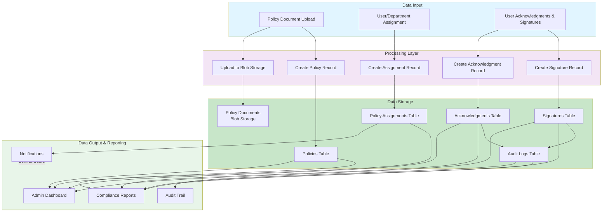

---

## 14. INTEGRATION POINTS

### 14.1 Azure Services Integration

| Service | Purpose | Integration |
|---------|---------|-------------|
| **Azure Entra ID** | User Authentication | MSAL for frontend, JWT validation in backend |
| **Azure SQL Database** | Primary Data Store | EF Core with ADO.NET provider |
| **Azure Blob Storage** | Document Storage | Azure SDK for uploading/downloading policy PDFs |
| **Application Insights** | Monitoring & Diagnostics | SDK integrated in ASP.NET Core |
| **Key Vault** | Secrets Management | Connection strings, API keys stored securely |
| **App Service** | Hosting | Both frontend and backend hosted |

### 14.2 External API Integrations

| API | Purpose | Authentication |
|-----|---------|-----------------|
| **Azure Graph API** | User profile data | OAuth 2.0 (via MSAL) |
| **Microsoft Teams** | Notifications | Webhooks (future phase) |
| **Email Service** | Policy notifications | SendGrid / Azure Communications (future) |

---

## 15. SECURITY ARCHITECTURE

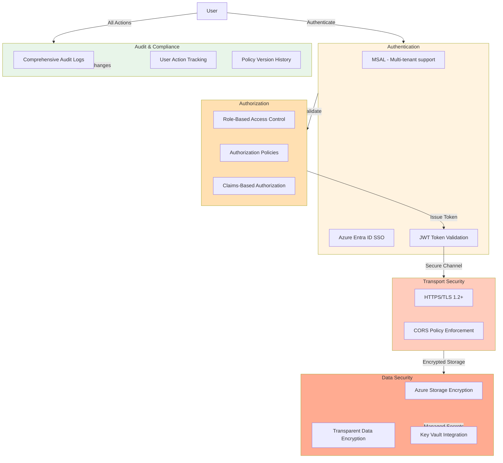

---

## 16. DEPLOYMENT & DEVOPS

### 16.1 CI/CD Pipeline

```mermaid
graph LR
    Git["GitHub Repository"]
    Build["Build Stage<br/>npm run build<br/>dotnet publish"]
    Test["Test Stage<br/>Unit Tests<br/>Integration Tests"]
    StageDeploy["Deploy to Staging"]
    Approval["Manual Approval"]
    ProdDeploy["Deploy to Production"]
    Monitor["Monitor & Alerts"]
    
    Git -->|Trigger| Build
    Build -->|Publish Artifacts| Test
    Test -->|Pass| StageDeploy
    StageDeploy -->|Validate| Approval
    Approval -->|Approve| ProdDeploy
    ProdDeploy -->|Live| Monitor
    
    style Build fill:#e3f2fd
    style Test fill:#f3e5f5
    style StageDeploy fill:#e8f5e9
    style ProdDeploy fill:#c8e6c9
    style Monitor fill:#fff3e0
```

### 16.2 Environment Configuration

| Environment | Frontend | Backend | Database |
|-------------|----------|---------|----------|
| **Development** | http://localhost:3000 | http://localhost:5007 | Local/Dev SQL |
| **Staging** | policyhub-staging.azurewebsites.net | policyhub-api-staging.azurewebsites.net | Azure SQL Dev |
| **Production** | policyhub.azurewebsites.net | policyhub-api.azurewebsites.net | Azure SQL Prod |

---

## 17. PERFORMANCE & SCALABILITY

### 17.1 Caching Strategy

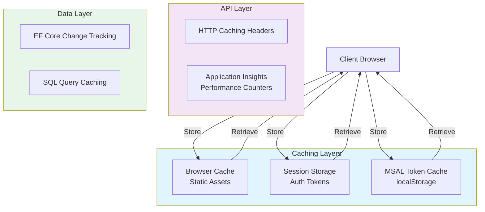

### 17.2 Scalability Features

- **Horizontal Scaling:** App Services configured for auto-scale (2-4 instances)
- **Load Balancing:** Azure Application Gateway distributes traffic
- **Database:** Connection pooling configured in EF Core
- **Blob Storage:** Geo-redundant replication (GRS)
- **CDN:** Static assets cached globally

---

## 18. ERROR HANDLING & RESILIENCE

```mermaid
graph TB
    subgraph Frontend["Frontend Error Handling"]
        TokenExpiry["Token Expiry"]
        NetworkError["Network Errors"]
        ValidationError["Form Validation"]
    end
    
    subgraph Backend["Backend Error Handling"]
        AuthError["Authentication Failures"]
        DbError["Database Errors"]
        BlobError["Blob Storage Errors"]
    end
    
    subgraph Recovery["Recovery Strategy"]
        TokenRefresh["Silent Token Refresh"]
        Retry["Exponential Backoff Retry"]
        FallbackUI["Fallback UI States"]
    end
    
    TokenExpiry -->|Handle| TokenRefresh
    NetworkError -->|Handle| Retry
    ValidationError -->|Handle| FallbackUI
    
    AuthError -->|Handle| TokenRefresh
    DbError -->|Handle| Retry
    BlobError -->|Handle| Retry
    
    style Frontend fill:#ffccbc
    style Backend fill:#ffb74d
    style Recovery fill:#a5d6a7
```

---

## PPT-READY SUMMARY SECTION

---

## 19. EXECUTIVE OVERVIEW

### Vision
Policy Hub is a cloud-native enterprise policy management platform that digitizes policy distribution, acknowledgment, and compliance tracking.

### Key Benefits
✅ **Reduced Compliance Risk** - Digital acknowledgment and signature trails  
✅ **Improved Efficiency** - Automated policy assignment and notifications  
✅ **Enhanced Transparency** - Comprehensive audit logs and reporting  
✅ **Scalable Infrastructure** - Cloud-based with auto-scaling capabilities  
✅ **Enterprise Security** - Azure Entra ID SSO and RBAC  

### Core Capabilities
1. **Policy Management** - Upload, version, and manage organizational policies
2. **User Engagement** - Digital acknowledgment and signature workflows
3. **Role-Based Access** - Granular permissions for employees, admins, auditors
4. **Compliance Tracking** - Complete audit trail of all actions
5. **Reporting** - Dashboard and export capabilities for compliance

---

## 20. TECHNICAL HIGHLIGHTS

### Resilience & Availability
- Multi-tier architecture for fault isolation
- Auto-scaling based on demand
- Geo-redundant storage
- Comprehensive monitoring and alerting

### Security
- OAuth 2.0 with Azure Entra ID
- Role-based access control (RBAC)
- Encrypted data in transit and at rest
- Comprehensive audit logging

### Scalability
- Stateless microservices design
- Azure app services auto-scale to 4 instances
- Load-balanced API gateway
- Optimized database with connection pooling

### Developer Experience
- RESTful API design
- TypeScript/React frontend
- Entity Framework ORM
- Clear separation of concerns

---

## 21. ROADMAP & FUTURE ENHANCEMENTS

### Phase 2 (Q3-Q4 2026)
- [ ] Advanced reporting dashboard (Power BI integration)
- [ ] Email notifications (Azure Communications Service)
- [ ] Mobile app (React Native)
- [ ] Workflow builder (low-code policy approval workflows)

### Phase 3 (2027)
- [ ] Document automation (template-based policy generation)
- [ ] Machine learning analytics (policy effectiveness scoring)
- [ ] Microsoft Teams integration
- [ ] Multi-tenant SaaS deployment

### Phase 4 (2027+)
- [ ] E-signature integration (DocuSign/Adobe Sign)
- [ ] API marketplace for third-party integrations
- [ ] Advanced compliance reporting (SOC 2, ISO 27001)

---

## 22. COST ESTIMATION (Monthly Azure)

| Resource | SKU | Estimated Cost |
|----------|-----|-----------------|
| App Service (Frontend) | B2 (2 instances) | $50-75 |
| App Service (Backend) | B2 (2 instances) | $50-75 |
| SQL Database | Standard S2 | $150-200 |
| Blob Storage (100GB) | Hot Tier | $2-3 |
| Application Insights | Pay-as-you-go | $10-20 |
| Key Vault | Standard | $0.6 |
| **TOTAL** | | **$263-374** |

---

## 23. DECISION MATRIX

| Decision | Choice | Rationale |
|----------|--------|-----------|
| **Frontend Framework** | React 18.3 | Reactive UI, component reusability, MSAL support |
| **Backend Framework** | .NET 8 + ASP.NET Core | Enterprise-grade, high performance, Azure integration |
| **Database** | Azure SQL Server | ACID compliance, full-featured relational DB |
| **Authentication** | Azure Entra ID + MSAL | Enterprise SSO, security, no credential management |
| **Document Storage** | Azure Blob Storage | Cost-effective, scalable, integrated encryption |
| **Deployment** | Azure App Service | Managed platform, auto-scaling, no infrastructure management |
| **Architecture Pattern** | Layered + Repository | Clear separation of concerns, testable, maintainable |

---

## 24. CONCLUSION

Policy Hub represents a modern, enterprise-grade solution for policy management built on cloud-native principles. The architecture emphasizes security, scalability, and maintainability, with Azure services providing a robust foundation for growth and future enhancements.

### Contact & Questions
- **Architecture Lead:** [Contact Information]
- **Project Manager:** [Contact Information]
- **Technical Leads:** [Contact Information]

---

**Document Classification:** Internal | **Last Updated:** June 2026 | **Version:** 1.0
